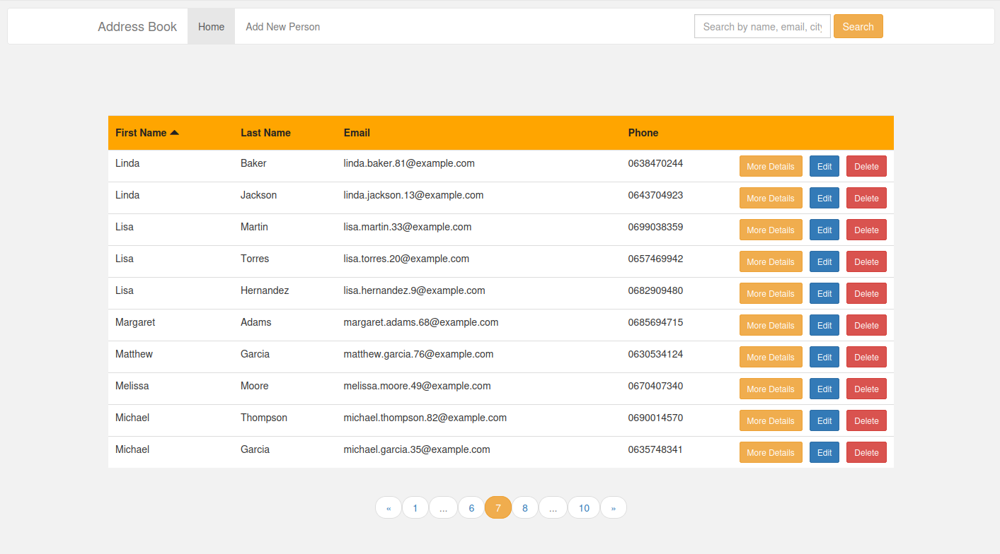
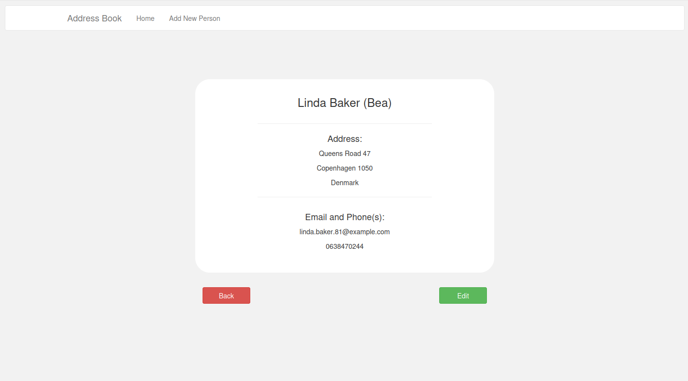
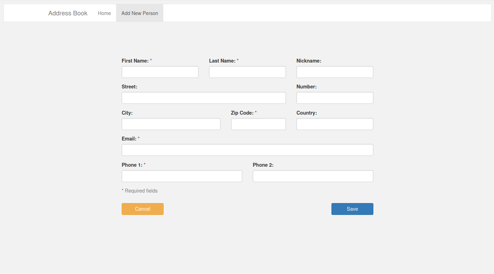
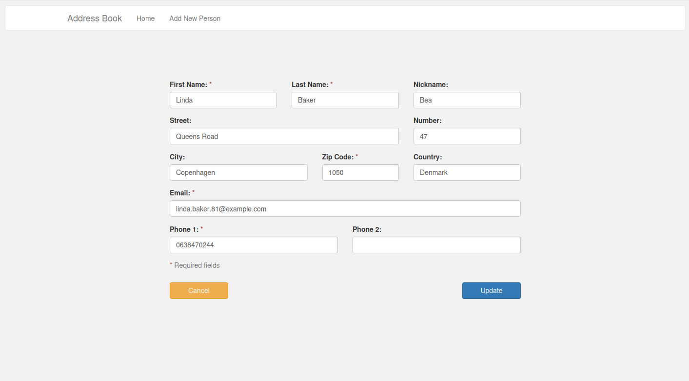
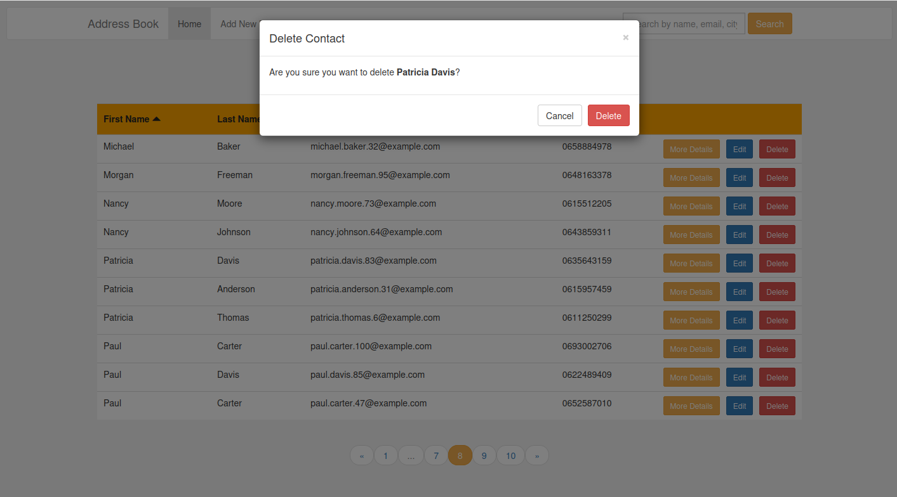

# Address Book CRUD

Small PHP MVC-style address book app with CRUD, search, sort, pagination, and Bootstrap UI. This is a demo project focused on clean structure, validation, and basic security practices.

## Features
- Create, edit, view, delete contacts
- Search + sort + pagination
- Server-side validation + input normalization
- CSRF protection on all POST actions
- Flash messages

## Tech
- PHP (PDO)
- MySQL
- Bootstrap 3

## Requirements
- PHP 8.0+
- MySQL 5.7+ / MariaDB 10+
- Web server (Apache/Nginx)

## Setup
1. Create a database:
   - `address_book`
2. Import the schema:
   - `mysql -u <user> -p address_book < schema.sql`
3. (Optional) Seed demo data:
   - `mysql -u <user> -p address_book < seed.sql`
4. Copy `.env.example` to `.env` and update credentials:
   - `DB_HOST`, `DB_NAME`, `DB_USER`, `DB_PASS`
5. Point your web server to `public/`.

## Usage
- Open `public/index.php` in the browser
- Add contacts via “Add New Person”
- Use search and sorting on the list (search is not shown on create/edit pages)

## Security Notes
- CSRF protection is enabled for create, edit, and delete.
- Secrets are loaded from `.env` (not committed).

## Project Structure
```
classes/            # Models + DB
public/             # Entry points, views, assets
public/partials/    # Shared UI + helpers
```

## Screenshots






## Roadmap Ideas
- Extract a shared layout for all pages
- Add minimal tests
- Dockerize for easier setup
